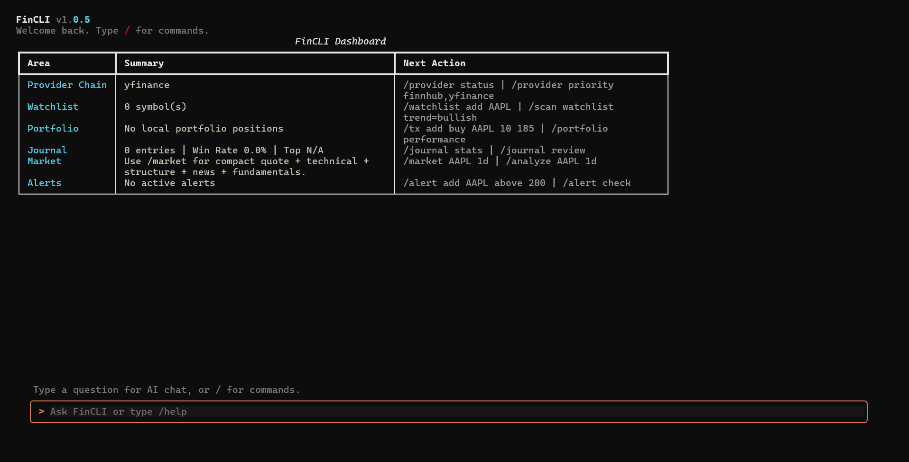

# FinCLI v1.0.5

FinCLI is a production-ready financial CLI/TUI terminal for market research, technical analysis, AI-assisted analysis, provider management, portfolio risk, journaling, watchlists, backtesting, paper trading, and local-first financial workflows.

Data quality depends on provider availability, API keys, provider plan entitlement, exchange coverage, and rate limits. yfinance remains the default delayed fallback.

## Terminal Preview



## Highlights

- Textual + Rich terminal UI with slash commands.
- Research-first workflow through `/research`, powered by Research Engine v3 (snapshot/deep/report, cited sources, sector/macro/news blending, web fallback).
- Provider System v2: formal capability declarations, `ProviderResponse` envelope with quality scoring (0-100), per-operation metrics, manual circuit breaker reset via `/provider reset`.
- Provider fallback chain with granular reliability labels and circuit breaker visibility.
- Source quality and freshness scoring in `/research` and `/market`.
- Provider metrics dashboard with per-operation breakdown and persistent all-time storage.
- AI Grounding Guard: prompts consider data quality, provider reliability, missing data, and trust gate.
- Market data adapters: yfinance, Finnhub, Twelve Data, Alpha Vantage, and custom provider schema.
- 100+ news connector catalog with free RSS fallbacks.
- AI providers: OpenRouter, OpenAI, Groq, Together, HuggingFace, Gemini, Anthropic.
- Technical analysis: RSI, MACD, EMA/SMA, Bollinger Bands, ATR, support/resistance, market structure.
- Portfolio Risk v3: exposure, concentration, drawdown, risk budget, PnL, health score.
- Trading Safety Layer: risk guard, immutable audit log, paper trading, 3 algo strategies.
- Broker sandbox adapters and realtime streaming (Kraken, HyperLiquid, equity polling).
- Professional backtesting: fees/slippage, walk-forward, position sizing, Monte Carlo, export.
- Portfolio analytics: snapshots, risk ratios, rebalancing, benchmark comparison, what-if analysis.
- Alert daemon with conditional alerts and alert history.
- Streaming AI output with separate display container (no conversation history loss).
- Theme system with 7 presets and custom theme support (create, import, export).
- Error classification, crash context, and `/doctor report` for diagnostics.
- Plugin system with manifest validation, sandbox, and lifecycle hooks.
- Security: encrypted secrets at rest, token pattern scanning, input validation, `/security scan`.
- Automated CI/CD: GitHub Actions tests on 3 OSes, auto-publish to npm/PyPI on tag.
- Session history with resume support.
- Local-first storage: SQLite database, encrypted secrets, cache, sessions, audit log.

---

## Installation Guide

### Prerequisites

- **Python 3.11+**
- **Node.js 18+** (for npm wrapper only)

### Step 1: Install Python

Check if installed:

```bash
python --version
```

If not installed or version < 3.11:

**Windows:** Download from [python.org/downloads](https://www.python.org/downloads/). Check "Add Python to PATH".

**macOS:** `brew install python@3.12` or download from [python.org](https://www.python.org/downloads/).

**Linux (Ubuntu/Debian):** `sudo apt install python3.11 python3.11-venv python3-pip -y`

**Linux (Fedora):** `sudo dnf install python3.11 python3-pip -y`

**Linux (Arch):** `sudo pacman -S python python-pip`

### Step 2: Install Node.js (npm wrapper only)

**Windows/macOS:** Download LTS from [nodejs.org](https://nodejs.org/).

**Linux (Ubuntu/Debian):**
```bash
curl -fsSL https://deb.nodesource.com/setup_20.x | sudo -E bash -
sudo apt install nodejs -y
```

### Step 3: Install FinCLI

**Option A: npm (recommended for users)**
```bash
npm install -g @drico2008/fincli
fincli setup
fincli
```

**Option B: pip (recommended for developers)**
```bash
git clone https://github.com/your-username/fincli.git
cd fincli
python -m venv .venv
source .venv/bin/activate   # Windows: .venv\Scripts\activate
pip install -e ".[dev]"
fincli
```

### Step 4: Verify

```bash
fincli
/help
/doctor
```

### Step 5: API Keys (Optional)

```text
/ai_model key groq <api_key>
/news_model key finnhub <api_key>
/news_model key twelvedata <api_key>
/news_model key alphavantage <api_key>
```

Free key sources: [Groq](https://console.groq.com/), [OpenRouter](https://openrouter.ai/), [Finnhub](https://finnhub.io/), [Twelve Data](https://twelvedata.com/), [Alpha Vantage](https://www.alphavantage.co/)

---

## Quick Start

```text
/research AAPL              # Market snapshot
/research AAPL --deep       # AI deep analysis
/market AAPL 1d             # Quote + news + technical
/portfolio add AAPL 10 185  # Track a position
/watchlist add AAPL         # Add to watchlist
/journal add AAPL bullish   # Log a trade idea
/alert add AAPL above 200   # Price alert
/history                    # Browse sessions
```

---

## Core Commands

Research and market:

```text
/research AAPL [--snapshot|--deep|--report] [--export md|json path]
/market AAPL 1d
/news AAPL
/technical AAPL 1d
/analyze AAPL 1d
/mtf AAPL 1d,1h,15m
/calendar week US high
```

Providers:

```text
/provider status
/provider metrics
/provider capabilities
/provider reset <provider>
/provider key status
/provider key rotate <provider>
/provider test AAPL
```

Portfolio and risk:

```text
/portfolio
/portfolio add AAPL 10 185
/portfolio update AAPL 5 160       # DCA
/portfolio history                  # Snapshot history
/portfolio risk
/portfolio benchmark SPY
```

Workflow:

```text
/watchlist add AAPL [group] [notes]
/watchlist list <group>
/scan watchlist rsi<30
/journal add AAPL bullish "setup"
/journal stats
/journal review
/alert add AAPL above 200
/history
```

Themes:

```text
/theme list
/theme ocean
/theme create mytheme --base midnight
/theme import theme.json
/theme export midnight theme.json
```

System:

```text
/doctor
/doctor report              # Diagnostic dump (no secrets)
/setup                      # First-run wizard
/secrets status
/security scan              # Token pattern scan
/security lockdown          # Emergency secret wipe
/plugin list
/plugin validate
/cache stats
/cache clear
```

---

## Research Engine v3

`/research` returns a compact, source-aware output:

- Snapshot, Signal, Risk, Context (sector + macro + news blend)
- Trust Gate, Missing Data, Source Quality, Decision Points
- Sources (cited market, news, macro, fundamentals, web)
- Final Summary

Modes: `--snapshot` (default), `--deep` (AI-powered), `--report` (report-oriented). Exports: `--export md|json`.

## Portfolio Risk v3

`/portfolio risk` calculates: exposure by asset class, currency exposure, concentration risk, drawdown estimate, risk budget, realized/unrealized PnL, portfolio health score.

## Data Notes

- yfinance is delayed fallback, not realtime.
- Providers may require API keys and paid plans.
- AI output is informational, not financial advice.

## Local Storage

```text
~/.fincli/config.json
~/.fincli/secrets.env        # Encrypted at rest
~/.fincli/fincli.db
~/.fincli/themes/            # Custom themes
```

## License

MIT
