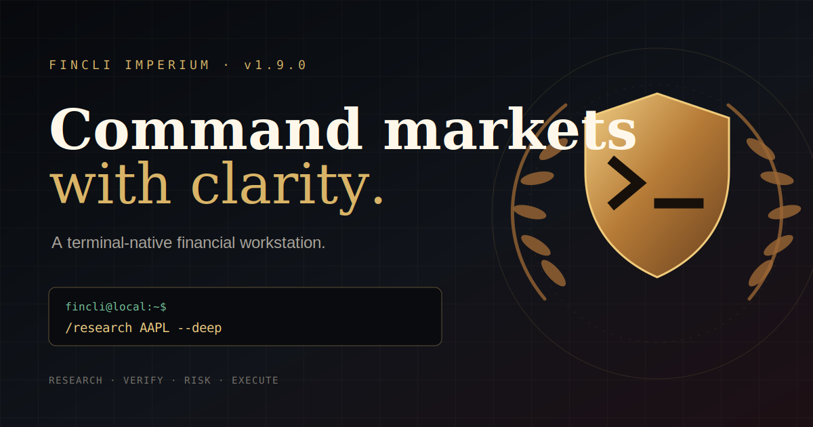

# FinCLI v1.9.0

[](https://www.npmjs.com/package/@drico2008/fincli)
[](https://www.npmjs.com/package/@drico2008/fincli)
[](LICENSE)


[](https://badge.socket.dev/npm/package/@drico2008/fincli)

**A terminal-native financial workstation. Research, trade, and analyze markets without leaving your shell.**



---

## Why FinCLI

- **Trade from the terminal** — Live broker integration (Alpaca + Binance) with risk guard, kill switch, and immutable audit log. Not just a data viewer.
- **AI that knows your data** — The assistant is grounded in your provider's actual data quality, reliability scores, and missing data gaps. No hallucinated prices.
- **Research Engine v4** — Snapshot, deep analysis, or structured report with facts, inferences, scenario matrix, source scoring, and trust-capped citations — all from `/research AAPL`.
- **Local-first, no cloud lock-in** — SQLite, encrypted secrets at rest, session recovery. Your data stays on your machine.

> ⚠️ AI output is informational only, not financial advice. Data quality depends on your provider and API plan.

---

## Install

```bash
npm install -g @drico2008/fincli
fincli setup
fincli
```

The npm package includes Local Web Access dependencies. Python source users can install them with `pip install -e ".[web]"`.

Requires Python 3.11+ and Node.js 18+. See [Prerequisites](#prerequisites) if you need to install them.

---

## Quick Start

```text
/research AAPL --deep          # AI-powered deep analysis with cited sources
/chart AAPL 1d --overlay rsi,macd  # ASCII candlestick with indicators
/scan sp500 rsi<30             # Screen S&P 500 for oversold stocks
/portfolio add AAPL 10 185     # Track a position
/trading live connect alpaca paper  # Connect to Alpaca paper trading
```

## Local Web Access

FinCLI v1.9.0 adds an optional, authenticated browser workspace at `http://localhost:19850`. The terminal remains the primary interface and all existing commands continue to work.

```bash
pip install -e ".[web]"
fincli web start
# or: fincli --web
```

From the TUI, use `/web start`, `/web status`, `/web open`, `/web stop`, `/web logs`, `/web token rotate`, or `/web config`. Existing `/web <research query>` behavior remains available.

The UI includes local conversation history, responsive dark/light themes, provider and model status, streaming-ready chat, research shortcuts, and a safe bridge to the existing FinCLI command router.

Type `/` in the web composer to browse and search the complete FinCLI command registry. Slash commands use the same `CommandRouter` and local services as the terminal. Commands that change sensitive state require browser confirmation; commands containing raw credentials remain terminal-only so secrets cannot leak into web or session history.

> The local web UI is intended for local use. Do not expose it publicly unless you understand the security risks. Authentication is enabled and the server binds to `127.0.0.1` by default. Browser responses never include stored API keys or broker secrets, and sensitive commands require explicit confirmation.

Screenshot placeholder: `docs/images/web-chat-v1.9.0.png`

Troubleshooting: if web dependencies are missing, run `pip install -e ".[web]"`. Use `/web logs` for startup errors and `/web config set port <port>` if port `19850` is occupied.

---

## What You Can Do

### Research & Analysis
```text
/research AAPL [--snapshot|--deep|--report] [--export md|json path]
/market AAPL 1d          # Quote + news + technical summary
/technical AAPL 1d       # RSI, MACD, EMA/SMA, Bollinger, ATR
/mtf AAPL 1d,1h,15m      # Multi-timeframe analysis
/chart AAPL 1d [--overlay rsi,macd] [--width 80] [--height 20]
/news AAPL               # 100+ news sources, free RSS fallback
/calendar week US high   # Economic calendar
```

Research Engine v4 returns: Snapshot → Signal → Risk → Context → Trust Gate → Verified Facts → Inferences → Missing Data → Scenario Matrix → Source Scores → Summary.

---

### Portfolio & Risk
```text
/portfolio                          # Overview
/portfolio add AAPL 10 185          # Add position
/portfolio update AAPL 5 160        # DCA update
/portfolio risk                     # Exposure, concentration, drawdown, PnL, health score, VaR
/portfolio correlation              # Pairwise correlation matrix between holdings
/portfolio tax                      # Realized PnL summary for tax reporting
/portfolio benchmark SPY            # Benchmark comparison
/portfolio rebalance                # Equal-weight suggestions
/portfolio create crypto            # Multiple named portfolios
/portfolio switch crypto
/portfolio compare main
/portfolio history                  # Snapshot history
```

Portfolio Risk v3 calculates: asset class exposure, currency exposure, concentration risk, drawdown estimate, risk budget, realized/unrealized PnL, portfolio health score, VaR (historical + parametric).

---

### Live Trading
```text
/trading live connect alpaca paper  # Connect broker (paper mode)
/trading live connect alpaca live   # Connect broker (live mode)
/trading live buy AAPL 10 --confirm # Place order (confirmation required)
/trading live sell AAPL 5 --confirm
/trading live positions             # Broker positions
/trading live orders                # Order history
/trading live account               # Account info
/trading kill                       # Emergency stop — blocks all orders immediately
/trading resume
/trading audit                      # Immutable order audit log
```

Supported brokers: **Alpaca** (US equities, paper + live), **Binance** (crypto, testnet + live).

Safety defaults: 20% max position size, 5% daily loss limit, no leverage in paper mode, auto-disconnect on suspicious activity.

---

### Screener & Alerts
```text
/scan sp500 rsi<30 --limit 20       # Scan universe with filter
/scan nasdaq sma_cross              # Golden cross scan
/scan crypto below_resistance
/scan watchlist rsi<30              # Scan your watchlist
/watchlist add AAPL [group] [notes]
/watchlist list <group>
/alert add AAPL above 200           # Price alert
/notification add discord alerts <webhook_url>
/notification add telegram alerts <bot_token> <chat_id>
```

Universes: `sp500`, `nasdaq`, `crypto`, `forex`, `commodities`.
Filters: `rsi<30`, `sma_cross`, `sma_death`, `above_support`, `below_resistance`, and expression-based filters.

---

### Favourites & Quick Access
```text
/favourites                         # Show most-used symbols
/favourites add AAPL                # Add to favourites
/favourites remove AAPL             # Remove from favourites
```

Favourites are tracked by usage count — most-used symbols appear first.

---

### Command Aliases
```text
/p  → /portfolio    /t  → /technical    /r  → /research
/b  → /backtest     /w  → /watchlist    /j  → /journal
/m  → /market       /n  → /news         /a  → /alert
/s  → /scan
```

---

### AI Assistant
```text
/ai What is RSI?
/ai How do I use /backtest?
/ai_model                           # Interactive provider/model picker
```

Context-aware with token-based sliding window (4k tokens). Grounded in provider data quality, reliability scores, and missing data — so it won't confidently cite stale or unavailable data. Response caching (30-min TTL). Refuses programming questions by design.

Supported AI providers: OpenRouter, OpenAI, Groq, Together, HuggingFace, Gemini, Anthropic, Ollama.

---

### Backtesting & Journal
```text
/backtest AAPL sma_cross 1y        # Backtest a strategy
/backtest AAPL sma_cross 1y --fast 10 --slow 30  # Custom parameters
/backtest compare AAPL sma_cross,rsi_reversion,macd_divergence  # Compare strategies
/journal add AAPL bullish "setup"  # Log a trade idea
/journal stats
/journal review
/export journal csv journal.csv
/export portfolio json portfolio.json
/export all json ./exports
```

Backtesting includes: fees/slippage, walk-forward, position sizing, Monte Carlo, ASCII equity curve, export.
Strategies: sma_cross, rsi_reversion, momentum, bollinger_squeeze, macd_divergence, volume_breakout, mean_reversion, multi_factor.

---

### Providers
```text
/provider status                    # Provider health overview
/provider metrics                   # Per-operation breakdown
/provider trust                     # Trust level, fallback state, and AI confidence limit
/provider capabilities              # Formal capability declarations
/provider reset <provider>          # Manual circuit breaker reset
/provider key status
/provider key rotate <provider>
/provider test AAPL
/provider compare AAPL              # Compare all providers for same symbol
/news_model                         # Interactive market/news provider picker
```

Supported data providers: yfinance (delayed fallback), Finnhub, Twelve Data, Alpha Vantage, Polygon.io, IEX Cloud, custom provider schema.

Provider System v3 features: formal capability declarations, first-class Polygon/IEX wiring, `ProviderResponse` envelope with quality scoring (0–100), per-operation metrics, circuit breaker with manual reset, proactive health warnings on latency/error rate spikes.

Free API keys: [Groq](https://console.groq.com/) · [OpenRouter](https://openrouter.ai/) · [Finnhub](https://finnhub.io/) · [Twelve Data](https://twelvedata.com/) · [Alpha Vantage](https://www.alphavantage.co/) · [Polygon.io](https://polygon.io/) · [IEX Cloud](https://iexcloud.io/)

---

### System & Security
```text
/doctor                             # Health check
/doctor report                      # Diagnostic dump (no secrets)
/security status
/security scan                      # Token pattern scan
/secrets rotate ALPACA_API_KEY      # Rotate stored API key
/security lockdown                  # Emergency secret wipe
/security purge                     # Clear secrets, history, cache
/theme list
/theme ocean
/theme create mytheme --base midnight
/session save
/session restore
/plugin list
/plugin validate
/cache stats
/cache clear
/setup                              # Re-run first-run wizard
```

### Privacy Cleanup

Use `/security purge` for normal cleanup of stored secrets, the current terminal session history, and market caches. It keeps portfolio, journal, alerts, watchlist, profile, and configuration data.

To remove every saved terminal session, run `/history clear` as well:

```text
/security purge
/history clear
```

Stop Local Web Access before a complete secret cleanup. Starting it again may generate a new local web access token:

```text
/web stop
/security purge
```

FinCLI never prints deleted secret values. API keys must be configured again after a purge, and Local Web Access requires a newly generated token before the next login.

---

## Local Storage

```text
~/.fincli/config.json
~/.fincli/secrets.env        # Encrypted at rest (PBKDF2-SHA256)
~/.fincli/fincli.db          # SQLite database
~/.fincli/themes/
~/.fincli/plugins/
```

---

## Plugin System

Plugins extend FinCLI with custom commands via manifest (`plugin.json`), lifecycle hooks (`on_startup`, `on_shutdown`, `on_command`), and a sandboxed public API (`FinCLIPluginAPI`).

Blocked by default: `os`, `sys`, `subprocess`, `socket`, `exec()`, `eval()`, `open()`. All data access goes through the plugin API boundary.

---

## Prerequisites

<details>
<summary>Install Python 3.11+</summary>

**Windows:** Download from [python.org/downloads](https://www.python.org/downloads/). Check "Add Python to PATH".

**macOS:** `brew install python@3.12`

**Linux (Ubuntu/Debian):** `sudo apt install python3.11 python3.11-venv python3-pip -y`

**Linux (Fedora):** `sudo dnf install python3.11 python3-pip -y`

**Linux (Arch):** `sudo pacman -S python python-pip`

</details>

<details>
<summary>Install Node.js 18+</summary>

**Windows/macOS:** Download LTS from [nodejs.org](https://nodejs.org/).

**Linux (Ubuntu/Debian):**
```bash
curl -fsSL https://deb.nodesource.com/setup_20.x | sudo -E bash -
sudo apt install nodejs -y
```

</details>

<details>
<summary>Install from source (developers)</summary>

```bash
git clone https://github.com/Suryadharmaa/FinCLI-Renewed.git
cd fincli
python -m venv .venv
source .venv/bin/activate   # Windows: .venv\Scripts\activate
pip install -e ".[dev]"
fincli
```

</details>

---

## Changelog

### Next Major (validated, unreleased)
- **Provider System v3**: first-class Polygon.io and IEX Cloud market providers across manager, config, TUI selector, key status, entitlements, and symbol intelligence
- **Research Engine v4**: `/research --report` now includes verified facts, inferences, missing-data severity, bull/base/bear scenario matrix, citation IDs, and source scoring
- Preserves deterministic snapshot mode and existing v1.8.5 TUI cockpit behavior
- Validation passed: Ruff, compileall, 792-test pytest suite, npm wrapper check, prepublish safety check, and npm pack dry-run

### v1.9.0
- Add Local Web Access with a browser-based FinCLI dashboard
- Add a familiar local chat UI for AI-assisted market research and safe command execution
- Add an authenticated FastAPI server, SSE streaming endpoint, conversation persistence, model/provider status, CORS, CSRF header validation, rate limiting, and local-only defaults
- Add web views and shortcuts for research, portfolio, watchlist, backtesting, providers, and settings
- Preserve all v1.8.5 terminal workflows, including legacy `/web <query>` research

### v1.8.5
- **TUI Financial Cockpit Refresh**: add a top cockpit strip with version, provider, trust, AI model, session state, and shortcut hints
- Improve inline command palette grouping and first-match highlighting for faster terminal workflows
- Keep animations subtle and async: low-noise working spinner, streaming token counter, and no blocking UI effects
- Preserve release safety: no new dependencies, commands, schemas, provider contracts, or broker behavior changes

### v1.8.4
- **Trust & Reliability**: add `/provider trust` to summarize provider health, fallback behavior, data completeness, and AI confidence limits
- Clear trust labels: `Strong`, `Usable`, `Limited`, and `Blocked`
- Release-readiness cleanup: lint and smoke-test blockers fixed before feature work
- Keep the release focused: no schema changes, new dependencies, or provider contract changes

### v1.8.3
- Full codebase lint cleanup: 255 ruff errors → 0 across 80+ files
- Fix 6 critical undefined names (`Any`, `BaseBroker`, `Console`, `io`) that would crash at runtime
- Move 92 typing-only imports behind `TYPE_CHECKING` guard for faster startup
- Add `strict=False` to 7 `zip()` calls for explicit behavior
- Add `from None` to re-raises for proper exception chaining
- Fix `APP_DIR` import path in `database.py` (was importing from wrong module)
- Move `logger` assignments after imports in 3 files (PEP8 compliance)
- Replace `websockets` availability check with `importlib.util.find_spec`
- Remove unused variables and imports across codebase
- Update all test version assertions

### v1.8.2
- **Update notification**: npm users now see a banner when a new version is available
- Checks npm registry once per day (24h cache in `~/.fincli/.update-check`)
- Non-blocking — never delays app startup
- Silent on network errors or CI environments
- Zero new dependencies (uses Node.js built-in `https` module)

### v1.8.1
- Fix `sqlite3` not imported in `router.py` (3 locations would crash on DB error)
- Fix `t` loop variable shadowing `t()` translation function in 2 locations
- Remove 10 unused imports in `router.py` (ThemePreset, CrashContext, MODEL_CATALOG, etc.)
- Add `from None` to 4 re-raises in except blocks
- Add `strict=False` to `zip()` call in backtest compare
- Split 7 semicolon-oneline statements into proper multi-line
- Run `ruff --fix` for import sorting

### v1.8.0
- **Strategy Backtesting v2**: 4 new strategies (bollinger_squeeze, macd_divergence, volume_breakout, mean_reversion)
- Custom strategy parameters: `/backtest AAPL sma_cross 1y --fast 10 --slow 30`
- `/backtest compare` — compare multiple strategies on same symbol
- **Portfolio Analytics v2**: VaR (Value at Risk) with historical + parametric methods
- `/portfolio correlation` — pairwise correlation matrix between holdings
- `/portfolio tax` — realized PnL summary for tax reporting
- **New providers**: Polygon.io and IEX Cloud market data providers
- `/provider compare` — test same symbol across all providers, show latency/quality
- **Command aliases**: `/p`, `/t`, `/r`, `/b`, `/w`, `/j`, `/m`, `/n`, `/a`, `/s`
- `/favourites` — quick access to most-used symbols (tracked by usage count)
- Remove deprecated commands: `/security encrypt-key`, `/security decrypt-key`, `/trading algo`, `/provider insider`, `/provider ipo`
- Code quality: ruff and mypy configuration added
- Fix remaining Indonesian strings in router (~30 strings)

### v1.7.0
- Complete Indonesian → English translation (250+ strings across 20+ files)
- SQLite WAL mode for better concurrent read performance
- API key rotation: `/secrets age` and `/secrets rotate <KEY>` commands
- Key age warnings in `/security status` (alerts when keys > 90 days old)
- Dependency audit: `pip-audit` integrated into prepublish check
- Property-based testing with Hypothesis (crypto, formatting)
- Test infrastructure: `@pytest.mark.integration` and `@pytest.mark.slow` markers
- Add `hypothesis` dev dependency

### v1.6.0
- Ollama local LLM support (offline AI, no API key needed)
- Deprecate dead features: `/provider insider`, `/provider ipo`, `/security encrypt-key`, `/security decrypt-key`, `/trading algo`
- Internationalization: `/lang` command for English/Indonesian switching
- Security: path traversal fix in `/theme import/export`
- Security: XML billion laughs protection (defusedxml)
- Performance: fix O(n²) patterns in crypto, commands, exporter
- Fix 13 swallowed exception blocks across codebase
- Add timeouts to async future.result() calls
- Thread safety: event loop lock in MarketDataService
- Translate all Indonesian text to English (default language)
- Add `defusedxml` dependency for safe XML parsing

### v1.5.2
- Full codebase bug audit: 10 bugs fixed (2 High, 4 Medium, 4 Low)
- Binance: handle non-JSON error responses in API requests
- AlertDaemon: persistent event loop instead of new loop per iteration
- Binance: log price fetch errors instead of silent swallow
- MarketDataService: persistent event loop for sync wrapper
- Scan results: show error count summary for failed symbols
- Stream callbacks: log errors instead of silent swallow
- Kraken: expanded pair mappings (DOT, LINK, MATIC, AVAX)

### v1.5.1
- Deep code review: 17 bug fixes across codebase
- Fix operator precedence in provider error classification
- Fix frozen dataclass mutability (lists → tuples)
- Fix AlertDaemon silent exception swallowing
- Fix RiskGuard net notional calculation (buy - sell)
- Translate all remaining Indonesian text to English
- Case-insensitive provider matching in news aggregator
- Remove deleted `/quote` command from verb map

### v1.5.0
- WebSocket reconnect with exponential backoff + jitter
- Config schema validation with "did you mean?" suggestions
- Proactive provider health warnings (latency, error rate)
- ASCII equity curve for backtest results
- Memory optimization (session cleanup, 7-day retention)

### v1.4.0
- Universe-wide screener (sp500, nasdaq, crypto, forex, commodities)
- Multi-portfolio support (create, switch, compare, delete)
- Binance crypto broker integration (testnet + live)
- Extended scan filters: `sma_cross`, `sma_death`, `above_support`, `below_resistance`

### v1.3.0
- Terminal charting: ASCII candlestick with RSI/MACD overlays
- AI context sliding window (token-based, 4k tokens)
- Notification webhooks: Discord and Telegram
- Interactive model picker for `/ai_model` and `/news_model`

### v1.2.0
- Session state auto-save and crash recovery
- Hash-based AI response cache (30-minute TTL)
- Soft error detection (staleness, price anomalies)
- Plugin sandbox hardening (import whitelist, code validation)

### v1.1.0
- Live trading with Alpaca (paper + live)
- Broker key encryption (PBKDF2-SHA256)
- Command consolidation (removed 6 duplicates)
- `/portfolio rebalance` command
- `/export broker` command

### v1.0.5
- Research Engine v3
- Provider System v2
- Portfolio Risk v3
- Trading Safety Layer
- Plugin system
- Theme system

---

## License

MIT
